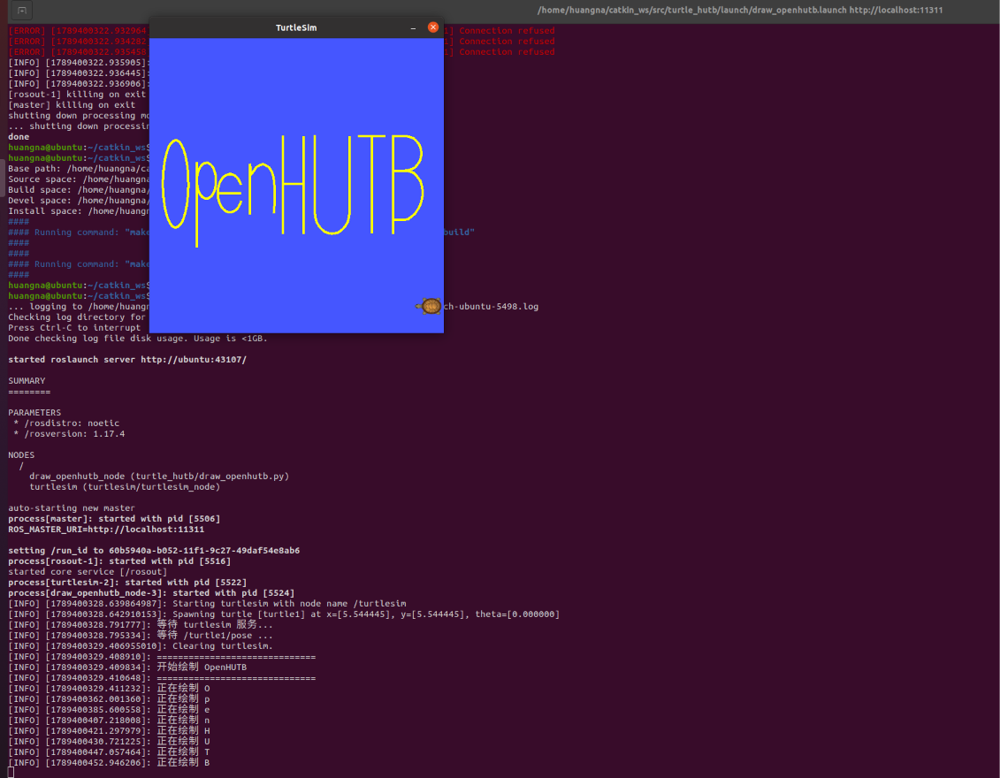

# 小海龟自动绘制 OpenHUTB

## 一、实验目的

本实验基于 Ubuntu 20.04、ROS Noetic 和 turtlesim，
编写 Python ROS 节点，使小海龟自动绘制 `OpenHUTB` 字样。

实验主要使用 ROS 的话题通信、服务调用以及闭环控制机制。

## 二、实验环境

| 项目 | 配置 |
| --- | --- |
| 操作系统 | Ubuntu 20.04 |
| ROS | ROS Noetic |
| 仿真器 | turtlesim |
| 编程语言 | Python 3 |
| 功能包 | turtle_hutb |

## 三、功能包结构

```text
turtle_hutb/
├── CMakeLists.txt
├── package.xml
├── launch/
│   └── draw_openhutb.launch
└── scripts/
    └── draw_openhutb.py
```

## 四、实现原理

程序订阅：

```text
/turtle1/pose
```

获取小海龟实时的位置和方向。

程序向：

```text
/turtle1/cmd_vel
```

发布 `geometry_msgs/Twist` 消息，实现小海龟的运动控制。

同时调用：

```text
/turtle1/set_pen
```

控制画笔打开和关闭。

调用：

```text
/turtle1/teleport_absolute
```

在不同笔画之间无轨迹移动。

H、U、T、B 四个字符被分解为多组目标坐标，
小海龟通过位姿反馈逐个运动到目标点，从而绘制完整字符。

## 五、编译

首先进入仓库中第一章源码目录：

```bash
cd src/chap1
```

进入工作空间：

```bash
cd ~/catkin_ws
```

编译：

```bash
catkin_make
```

加载环境：

```bash
source devel/setup.bash
```

## 六、运行

可以直接运行：

```bash
roslaunch turtle_hutb draw_openhutb.launch
```

也可以分别运行：

```bash
roscore
```

```bash
rosrun turtlesim turtlesim_node
```

```bash
rosrun turtle_hutb draw_openhutb.py
```

## 七、实验结果

运行节点后，小海龟会依次绘制 `O`、`p`、`e`、`n`、
`H`、`U`、`T`、`B`，最终形成 `OpenHUTB` 字样。

轨迹使用亮黄色，与 turtlesim 默认蓝色背景形成明显对比，
便于观察最终绘制结果。

程序利用 `/turtle1/pose` 的实时反馈进行闭环控制，
相比仅使用固定运行时间的开环控制方式，可以获得更加稳定的轨迹。



## 八、总结

本实验通过 turtlesim 熟悉了 ROS 中发布者、订阅者和服务的基本使用方式，
并通过闭环控制完成了较复杂的多字符轨迹绘制任务。
