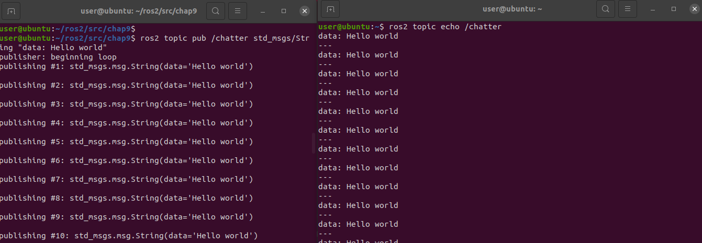
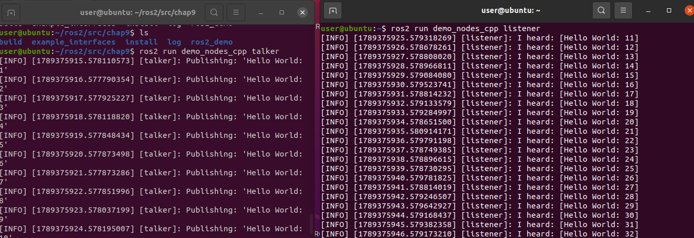

# ROS2 

以下测试都是基于 Ubuntu 20.04 ROS Humble

```shell
source /opt/ros/humble/setup.bash
ros2 topic pub /chatter std_msgs/String "data: Hello world"
# 重新打开一个终端
ros2 topic echo /chatter
```




## 运行 talker 和 listener 示例

```shell
ros2 run demo_nodes_cpp talker
ros2 run demo_nodes_cpp listener
```


