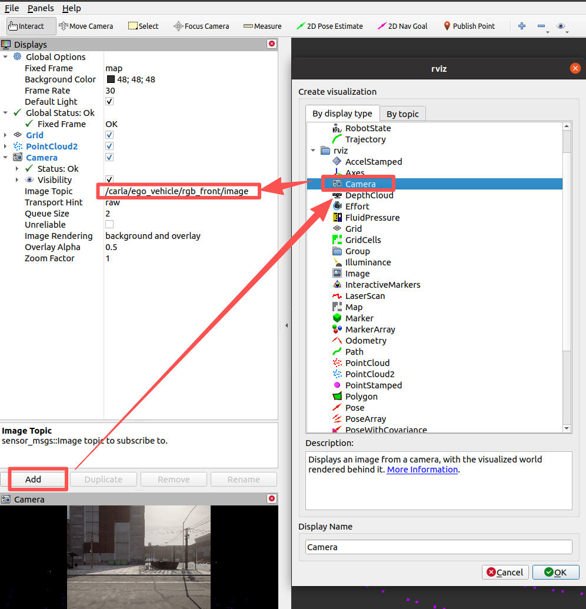

# RVIZ 地面载具插件

RVIZ 的地面载具插件提供了 ROS包的可视化工具。环境的配置参考[设置并连接到 Carla 模拟器](../set_up_and_connect_to_carla.md)。

## 初始化

先在默认的地图 Town10HD_Opt 中启动手动控制的 ROS 示例，为可视化提供数据源：
```shell
roslaunch carla_ros_bridge carla_ros_bridge_with_example_ego_vehicle.launch host:=172.21.108.47 timeout:=60000 town:='Carla/Maps/Town10HD_Opt' spawn_point:=-25,-134,0.5,0,0,-90
```

使用rviz查看传感器数据
```
rosrun rviz rviz
```


## 配置显示的数据

* 显示激光雷达数据

    在左侧点击`Add`，在弹出的对话框中选中`rviz->PointCloud2`。并在左侧新增的点云话题（PointCloud2 -> Topic）中点击下拉菜单，选中话题`/carla/ego_vehicle/lidar`后按回车。 这个时候中间的区域并没有切换到主车的雷达视角，需要再右边的 Views 窗口中，Target Frame 选中 `ego_vehicle`，Focal Point 的 X、Y、Z 都设置为 `0; 0; 0`

    

* 显示 RGB 相机数据
    
    在左侧点击`Add`，在弹出的对话框中选中`rviz->Camera`，在左侧的相机话题下拉菜单中选择（Camera -> Image Topic）`/carla/ego_vehicle/rgb_front/image` 并回车，就会显示实时的相机数据

    

* 显示 DVS、深度、语义分割相机

    和“显示 RGB 相机数据”一样，再次添加 3 个 Camera，选择的主题分别为：`/carla/ego_vehicle/dvs_front/image`、`/carla/ego_vehicle/depth_front/image`、`/carla/ego_vehicle/semantic_segmentation_front/image`

    

## 参考

* [RVIZ Carla 插件](https://openhutb.github.io/doc/rviz_plugin/)